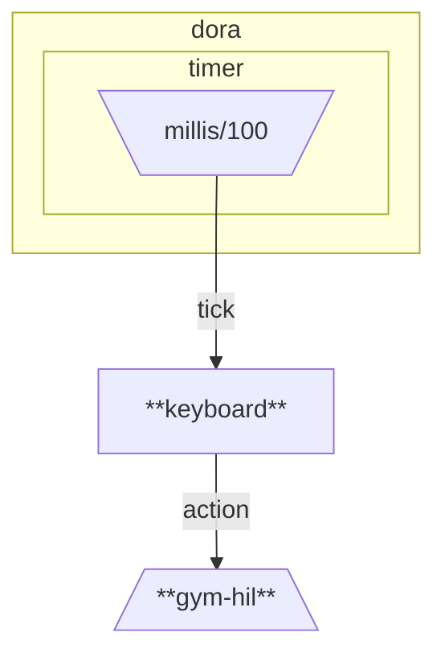
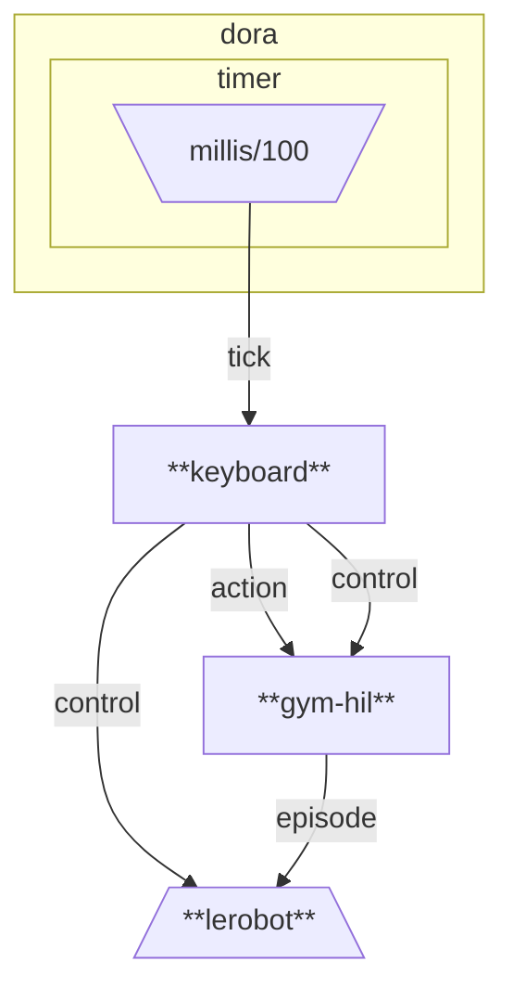

# LeRobot Trial

Playground to experiment with LeRobot without real robots.
Currently uses [Gym-HIL](https://github.com/huggingface/gym-hil) for simulated robotics environments and [Dora-rs](https://github.com/dora-rs/dora) for dataflow orchestration.

## Setup

Ensure the *latest* [`mise`](https://mise.jdx.dev) is installed, then run:

```shell
# Install tools managed by mise
mise install

# Create virtual environment
uv venv -p "$(mise which python)"

# Install Python dependencies
uv sync --frozen

# Activate virtual environment
source .venv/bin/activate
```

Currently, FFmpeg's major version must be at most 7 to be compatible with PyTorch used by LeRobot.

```shell
brew install ffmpeg@7
```

## Try Teleoperation

Run the Dora dataflow defined in `dataflow-demo.yaml`:

```shell
dora run dataflow-demo.yaml
```

For controlling the robot, use:

- *Arrow keys* to move in X-Y plane
- *Left and Right Shift* to move in Z axis
- *Left and Right Cmd* to open and close gripper

As a reference, the dataflow defined in `dataflow-demo.yaml` is as follows:



## Record Dataset

To record episodes, run the dataflow defined in `dataflow-record.yaml`:

```shell
# Optional: clear previous records to record from scratch
rm -rf outputs/record/gym_hil_trial

# Run the dataflow to record dataset
dora run dataflow-record.yaml

# Visualize recorded dataset using Rerun
DYLD_LIBRARY_PATH="$(brew --prefix ffmpeg@7)/lib" lerobot-dataset-viz \
  --repo-id "example/gym_hil_trial" \
  --root "outputs/record/gym_hil_trial" \
  --episode-index 0
```

The following key bindings are available to control data recording:

- *Esc* to stop data recording and exit
- *Ctrl* to break the current episode for re-recording
- *Space* to finish the current episode or reset the environment

Note that these control key bindings differ from the original LeRobot keyboard controls to avoid conflicts.

Typical recording scenarios include:

1. Execute `dora run dataflow-record.yaml`
   - MuJoCo window and supplementary Rerun window will open
2. Perform teleoperation to complete the task (e.g., pick up a cube)
3. The robot will freeze when the task is completed
4. Press *Space* to finish the episode
5. LeRobot enters a resetting phase, which is not recorded
6. Press *Space* to reset the environment (finish the resetting phase)
7. Repeat from step 2 until the desired number of episodes is recorded

Note that between 3 and 4, the last received frame is recorded repeatedly.

As a reference, the dataflow defined in `dataflow-record.yaml` is as follows:



## Train Policy

To train a policy using the recorded dataset, run:

```shell
$ DYLD_LIBRARY_PATH="$(brew --prefix ffmpeg@7)/lib" lerobot-train \
  --config_path examples/config_gym_hil_train.json
```

## Development

For code quality checks, run `mise all-checks`.
Refer to `mise.toml` for details.
