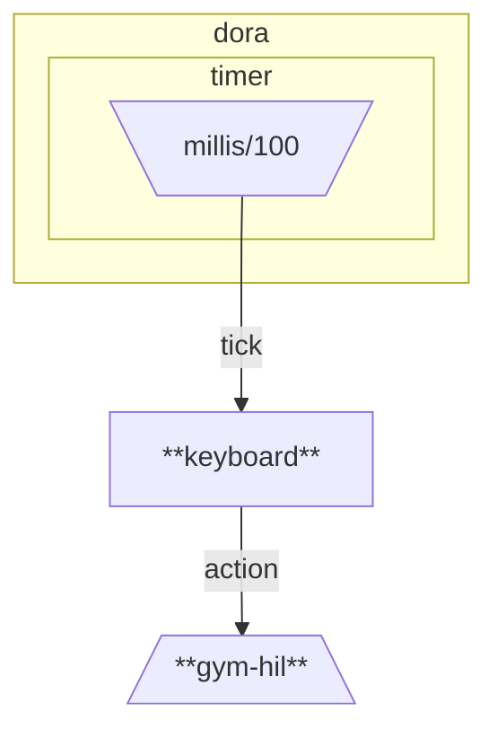

# LeRobot Trial

Playground to experiment with LeRobot without real robots.

## Setup

Ensure the *latest* [`mise`](https://mise.jdx.dev) is installed, then run:

```shell
# Install tools managed by mise
mise install

# Create virtual environment
uv venv -p "$(mise which python)"

# Install Python dependencies
uv sync --frozen

# Activate virtual environment
source .venv/bin/activate
```

## Try Teleoperation

Run the Dora dataflow defined in `dataflow-demo.yaml`:

```shell
dora run dataflow-demo.yaml
```

For controlling the robot, use:

- *Arrow keys* to move in X-Y plane
- *Left and Right Shift* to move in Z axis
- *Left and Right Cmd* to open and close gripper

As a reference, the dataflow defined in `dataflow-demo.yaml` is as follows:



## Development

For code quality checks, run `mise all-checks`.
Refer to `mise.toml` for details.
